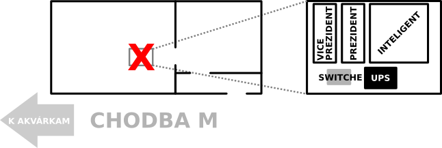

Sieť a jej obyvatelia
=====================

TODO

Sieť
--------------------

Máme pridelených 5 IP adries: 158.195.86.170-174
maska: 255.255.255.224
gateway: 158.195.86.161

Note: Kým sa dokončí [môj diabolský plán](meta/gut.md), máme aj staré adresy a staré mašiny a staré všetko, ako sa píše v starej wiki.

Mašiny, IPčky a do von otvorené porty
-------------------------------------

Note: Táto podsieť je za firewallom cca tvaru von všetko povolené a dnu všetko zakázané. Takže ak chceme čosi povoliť, treba poprosiť [správcu výpočťáku](#Výpočťák). A napísať sem!!!

### inteligent

*fyzická mašina vo výpočťáku*
**IP: 158.195.86.170**

Otvorené porty:

 - tcp:80 a tcp:443 (nginx)
 - tcp:22 (ssh)
 - udp:60000-61000 ([mosh](tips.md#mosh))

### ekvivalent

*fyzická mašina vo výpočťáku*
**IP: 158.195.86.171**

Note: ešte neexistuje.

Otvorené porty:

 - tcp:80 a tcp:443 (nginx alebo apache s mod_userdir)
 - tcp:22 (ssh)
 - udp:60000-61000 ([mosh](tips.md#mosh))
 - tcp:4000-10000 a udp:4000-10000 pre userov na hranie
 - TODO asi maily sem (postfix, IMAP, smtp...)

--------------------------------------------------------------------------------

### dirigent

*fyzická mašina v T2*
robí gateway z T2 a má káble do internetu a do nášho switchu vo výpočťáku

Výpočťák
--------

Správca výpočťáku a siete a všetkého je Mgr. Milan Babušík (M164, <milan.babusik@fmph.uniba.sk>)

Vo výpočťáku to vyzerá veľmi približne takto:

